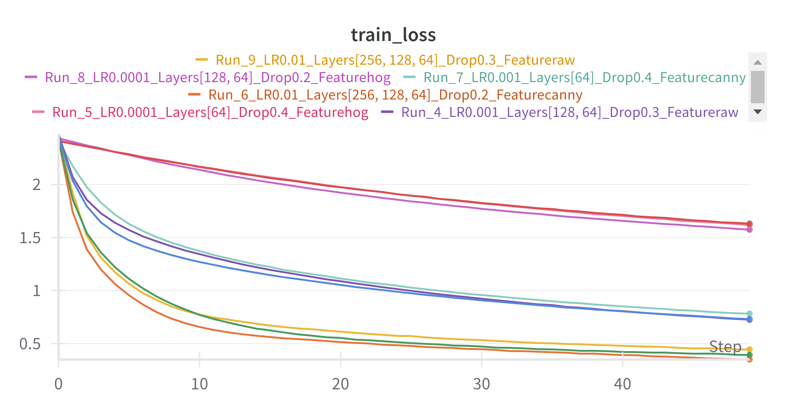
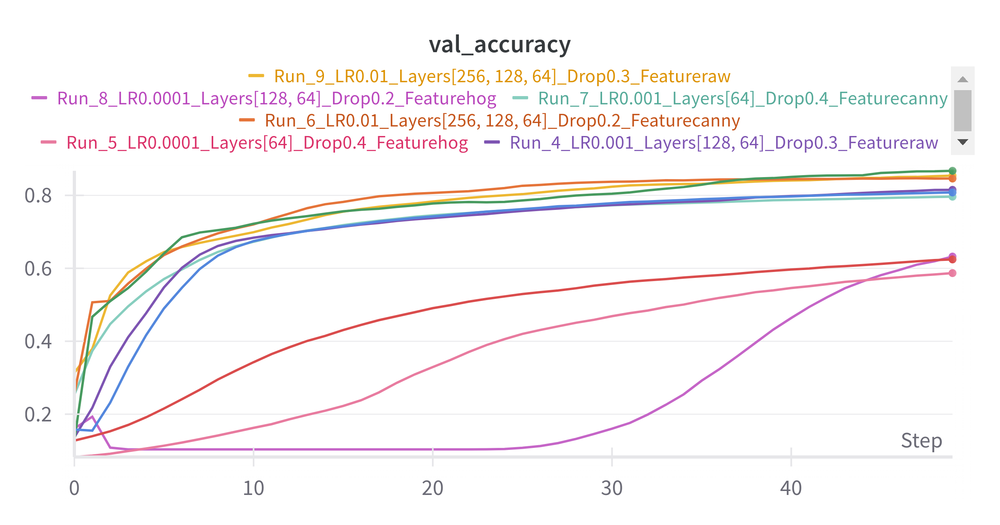
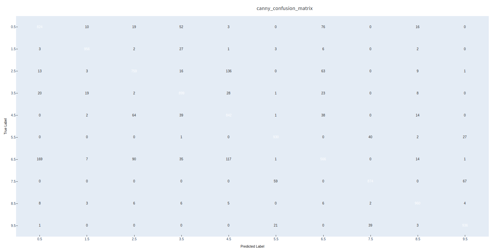
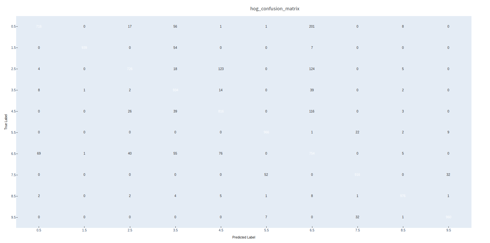
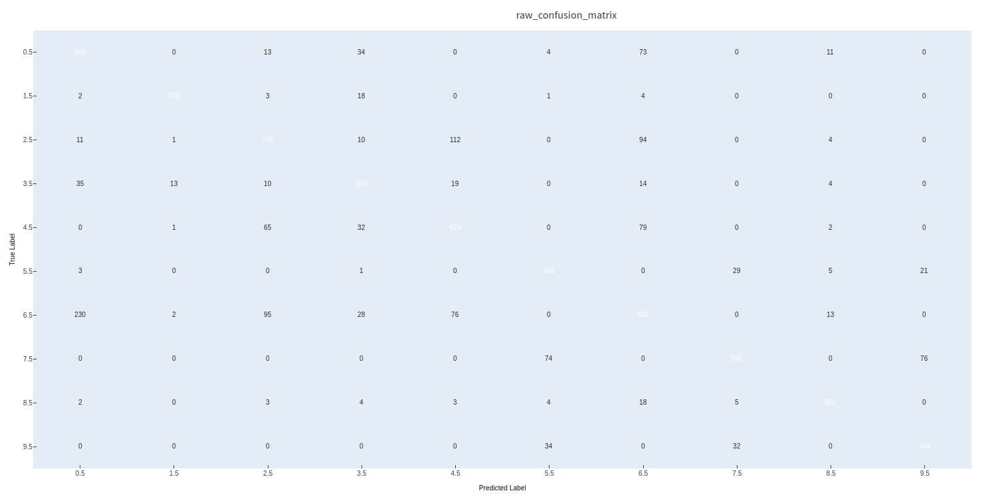
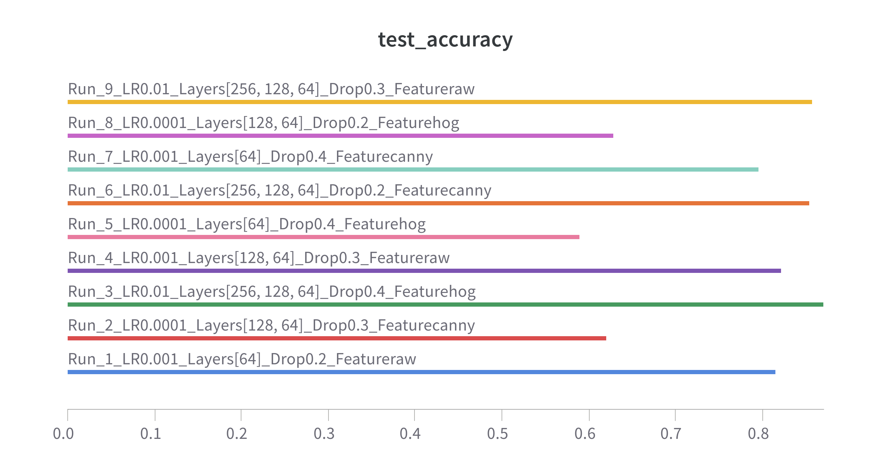
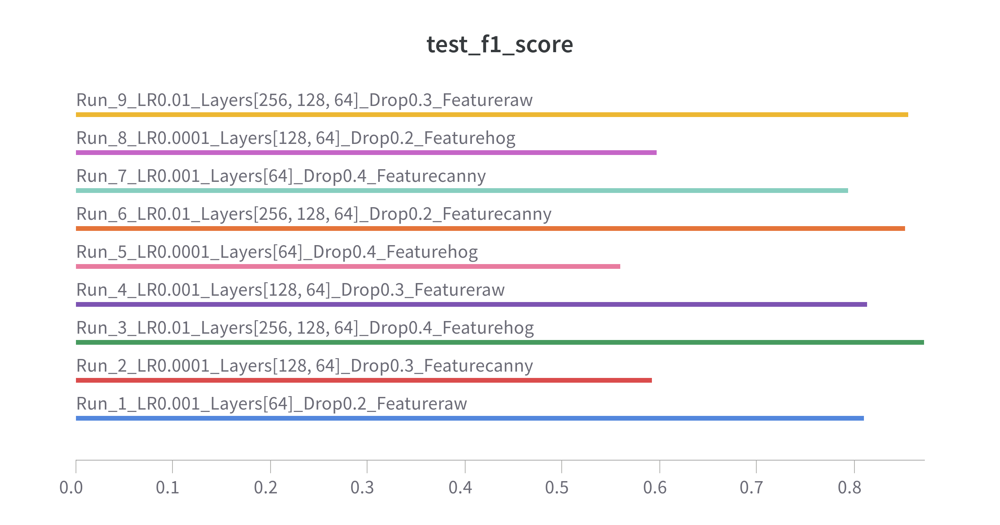
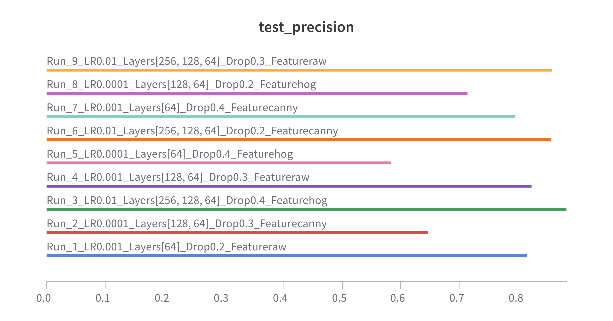
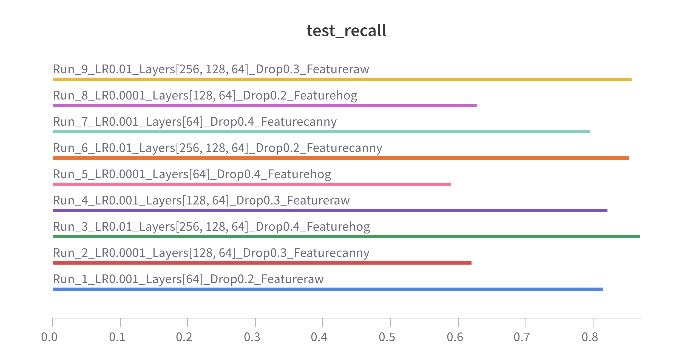

# Assignment 1
#### Name: Poorvi H C
#### Roll No: 2021113004

 

## Question 3 - MLP Classification

[**wandb link**](https://wandb.ai/poorvi-c-iiit-hyderabad/mlp-feature-runs?nw=nwuserpoorvic)

---

### Attach Images:

- 

-   

---

### Comments on Convergence:

**Raw Features Model (Run 9)**  
The Raw model demonstrates rapid convergence, achieving high validation accuracy early and stabilizing at 0.8573. Its training loss decreases steadily, indicating efficient learning and minimal overfitting. The balanced dropout rate (0.3) and learning rate (0.01) contribute to consistent performance and good generalization. This model benefits from leveraging unprocessed data, making it highly effective for capturing all feature details.

**Canny Features Model (Run 6)**  
The Canny model achieves slightly lower validation accuracy (0.8546) than the Raw model, with a slower convergence rate. While its training loss follows a similar decreasing trend, it remains slightly higher, indicating that edge-based features might be less discriminative. The lower dropout rate (0.2) and learning rate (0.01) help maintain stability during training. This model excels in edge detection but lacks the richness of raw data, impacting overall performance.

**HOG Features Model (Run 3)**  
The HOG model achieves the best validation accuracy (0.8703) among the three, though its convergence is more gradual. Its training loss steadily decreases and stabilizes, suggesting robust learning with minimal overfitting. The higher dropout rate (0.4) effectively regularizes the model, preventing overfitting and enhancing generalization. Structured HOG features provide meaningful information, allowing the model to outperform others in final accuracy and precision.

---

### Include Graphics:

-   
-   
-   

---

### Confusion Matrix Based Analysis:

The three images—Raw, HOG (Histogram of Oriented Gradients), and Canny—highlight distinct strengths and weaknesses in different image processing models.

1. **Raw Features**: The raw image preserves full details, making it useful for visual inspections and contexts where precise textures and colors are needed, but it lacks abstraction, which can hinder feature extraction for computational tasks.

2. **HOG Features**: The HOG image excels at capturing edge directions and gradient patterns, making it effective for object detection tasks like identifying shapes or movement patterns. However, it abstracts fine details, losing color and texture information.

3. **Canny Features**: The Canny image is highly effective for detecting strong edges and boundaries, useful for segmentation and edge-based analyses. However, it struggles with noise and can miss weak edges, especially in cluttered or low-contrast areas.

Together, these models demonstrate complementary strengths: Raw for detail, HOG for structured patterns, and Canny for edge precision, but they also reveal trade-offs in abstraction and noise sensitivity.

---

### Test Graphics:

-   
-   
-   
-   

---

### Discuss the Performance Differences Based on Input Features:

The **HOG model** performs the best (accuracy: 87.03%), leveraging structured gradient-based features that emphasize spatial patterns and shapes, making it robust for classification.  

The **Raw model** achieves a slightly lower accuracy (85.73%) because unprocessed input provides rich details but lacks abstraction, making it harder for the MLP to generalize.  

The **Canny model** has the lowest accuracy (85.46%) as edge-focused features can miss finer details, limiting its effectiveness in scenarios requiring nuanced feature extraction. Overall, structured and abstracted features (like HOG) appear more helpful for classification than raw or simple edge features.

---

### Explain How the Choice of Feature Extraction Impacts the MLP’s Ability to Learn and Generalize:

Feature extraction directly affects the complexity and relevance of the input.

1. **HOG Features**: Provide structured representations, allowing the MLP to focus on high-level patterns, improving learning and generalization, especially in tasks requiring shape and pattern recognition (e.g., object detection).  

2. **Canny Edges**: Simplify the input by focusing on boundaries, making it effective in scenarios with clear contrasts but limited in capturing finer details (e.g., text recognition).  

3. **Raw Features**: Give the MLP full access to input data, enabling flexibility but requiring more computational resources and potentially overfitting, making it suitable for tasks where detailed information is essential (e.g., medical imaging).
